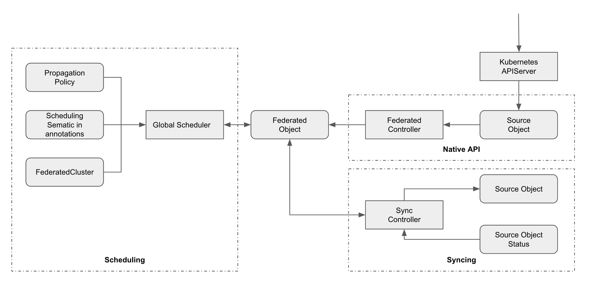

# KubeAdmiral - Enhanced Kubernetes Federation

English | [简体中文](./README.zh.md)

KubeAdmiral is a multi-cluster management system for Kubernetes, developed from [Kubernetes Federation v2](https://github.com/kubernetes-sigs/kubefed). Kubernetes Federation v2 allows users to manage Kubernetes resources across multiple clusters through the use of federated types such as FederatedDeployment, FederatedReplicaSet, FederatedSecret, etc. KubeAdmiral extends the Kubernetes Federation v2 API, providing compatibility with the Kubernetes native API and more powerful resource management capabilities. KubeAdmiral also adds new features such as:

- A new scheduling framework with a rich set of scheduling plugins.
- Override policies.
- Automatic propagation of dependencies with follower scheduling.
- Status aggregation of member cluster resources.
- Scalability, stability and user experience enhancements

# Getting started

KubeAdmiral supports Kubernetes versions from 1.16 up to 1.24. Using lower or higher Kubernetes versions may cause compatibility issues. For setup please refer to [Quickstart](./docs/quickstart.md).

# Community

## Contributing

If you are willing to be a contributor for the KubeAdmiral project, please refer to our [CONTRIBUTING](./CONTRIBUTING.md) document for details.

## Contact

If you have any questions or wish to contribute, you are welcome to communicate via GitHub issues or pull requests. Alternatively, you may reach out to our [Maintainers](./MAINTAINERS.md).

## License

KubeAdmiral is under the Apache 2.0 license. See the LICENSE file for details. KubeAdmiral is a continuation of Kubernetes Federation v2, and certain features in KubeAdmiral rely on existing code from Kubernetes &mdash; all credits go to the original Kubernetes authors. We also refer to [Karmada](https://github.com/karmada-io/karmada) for some of our architecture and API design, all relevant credits go to the Karmada Authors.
